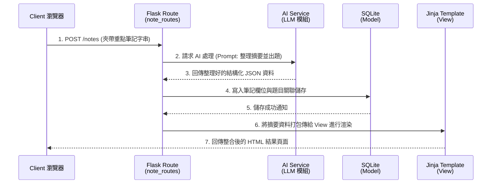

# 系統架構設計 (ARCHITECTURE) - AI 學習助理系統

## 1. 技術架構說明

本專案採用經典的 Python Flask 框架作為後端伺服器，並搭配 Jinja2 引擎進行傳統的伺服器端網頁渲染 (Server-Side Rendering)。資料庫採用輕量且無需額外安裝的 SQLite，適合 MVP 原型開發。

- **選定技術與原因**：
  - **後端 (Backend)**：`Python + Flask`。Flask 極度輕巧且擴充性高，配合 Python 完整的 AI 生態系與大量外部 API 依賴資源，相當適合打造整合型的 AI 應用。
  - **模板引擎 (View)**：`Jinja2`。因專案目標無需複雜的前端非同步操作，使用 Jinja2 結合 HTML 直出能夠省去前後端分離所需的學習成本及溝通接口負擔。
  - **資料庫 (Database)**：`SQLite`搭配 `SQLAlchemy` (ORM)。免安裝的特性極大便利本地環境開發測試。
  - **AI 模組整合**：透過 Python 後端 API 客戶端直接呼叫各大主流 LLM (例如 OpenAI API 或 Gemini API) 處理自動排版、出題與分析等邏輯。
  - **語音功能整合**：前台使用瀏覽器內建 Web Speech API (如 SpeechRecognition 與 SpeechSynthesis) 處理前端語音處理，減低後端處理音訊檔的延遲與效能負擔。

- **Flask MVC 模式說明**：
  - **模組/模型 (Model)**：負責資料結構以及業務驗證規則。例如規範一則筆記內容或一次測驗成績該如何儲存進 SQLite。
  - **視圖 (View)**：由 Jinja2 與靜態資料夾負責，設計包含表單、圖表等 HTML 畫面呈現。
  - **控制器 (Controller)**：對應 Flask 的 Routes，扮演收發者的角色，接收使用者請求、委任資料請求至 Model 或外部 AI API、再把最終結果發放給 View 來產生回應用戶的內容。

## 2. 專案資料夾結構

本系統採用預防混亂的模組化結構安排 (Application Factory 或 Blueprints 模式的概念)：

```text
ai_learning_assistant/
│
├── app/                      # 核心應用程式資料夾
│   ├── __init__.py           # Flask 初始化、資料庫物件與組態設定
│   ├── models/               # Model 模型定義層
│   │   ├── __init__.py
│   │   ├── user.py           # 學生帳號基本資料
│   │   ├── note.py           # 筆記內文及摘要資料表
│   │   └── exam.py           # 測驗紀錄與錯題資料表
│   │
│   ├── routes/               # Controller 路由控制層
│   │   ├── __init__.py
│   │   ├── auth_routes.py    # 使用者註冊與登入驗證
│   │   ├── note_routes.py    # 筆記新增、AI上傳分析邏輯
│   │   ├── exam_routes.py    # AI出題生成、送出答案計算成績
│   │   └── dash_routes.py    # 歷史紀錄與弱點分析畫面
│   │
│   ├── services/             # 外部依賴或商業邏輯封裝檔案
│   │   ├── ai_service.py     # 專門用於封裝發送給 LLM API 的各種 Prompt
│   │
│   ├── templates/            # View 的 Jinja2 模板
│   │   ├── base.html         # 網頁共用基礎版型
│   │   ├── auth/             # 註冊登入頁面
│   │   ├── notes/            # 筆記及摘要閱讀畫面
│   │   ├── exams/            # 測驗作答互動與解析介面
│   │   └── dashboard/        # 成績圖表展示及建議
│   │
│   └── static/               # 前端靜態資源庫
│       ├── css/
│       │   └── style.css
│       ├── js/
│       │   └── speech.js     # 前端網頁語音轉譯程式碼
│       └── images/
│
├── instance/                 # 保護性質之環境檔或本機資料庫
│   └── database.db           # SQLite 持久化檔案
│
├── docs/                     # 規格設計文件庫
│   ├── PRD.md                # 產品需求文件
│   └── ARCHITECTURE.md       # 系統架構文件 (本文)
│
├── requirements.txt          # Python 擴充套件版本管理
├── config.py                 # 全域變數定義及第三方 API KEY 綁定位
└── run.py                    # 系統進入點，用以開啟伺服器
```

## 3. 元件關係圖

以下展示經典流程：**「上傳單筆筆記，後端經由 AI 產生測驗，並保存後顯示」**。



## 4. 關鍵設計決策

1. **不採納前後端分離 (SPA) 架構**
   - **原因**：為快速建立原型並符合 MVP 以功能呈現為主的目標考量。省去處理跨域資源共用 (CORS) 以及維護獨立前端專案的複雜成本，將一切權限控制與渲染集中放在 Flask 能快速驗證市場價值。
2. **抽象獨立出 `ai_service.py` 進行模型隔離**
   - **原因**：AI 技術反覆代非常快速 (例如從 OpenAI GPT 轉向 Google Gemini 或其他開源模型)。透過 Service 層統一管理各種類別的 Prompt 字串與接收、重組邏輯，能避免日後替換模型導致 Controller 代碼難以維護與除錯。
3. **語音互動決策於「前端 Web Speech API」主導**
   - **原因**：為了迴避伺服器因為需要即時處理超大語音檔案帶來的 I/O 阻擋與資源負載，決議使用瀏覽器的 `SpeechRecognition` 功能把語音轉作「文字」後再交由後端處理，再交由 `SpeechSynthesis` 將文字轉回讀音。此舉能保持後端簡單清爽。
4. **選用 SQLAlchemy (ORM) 管理 SQLite**
   - **原因**：因預見學生擁有多篇筆記，一篇筆記對應多套試卷，一份試卷含有多筆錯誤分析等複雜的對聯需求。建立 Model 物件關係能讓日後維護省去撰寫冗雜艱澀的 SQL 原生語法查詢，並且若需要上線轉移至 PostgreSQL 亦能以極低的修改成本無縫接軌。
