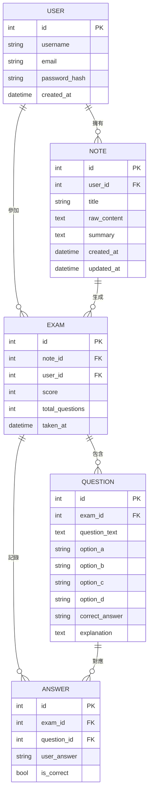

# 資料庫設計文件 (DB_DESIGN) - AI 學習助理系統

本文件根據 PRD.md、FLOWCHART.md 與 ARCHITECTURE.md，定義系統所有 SQLite 資料表的欄位、型別、關聯，以及 SQL 建表語法。

---

## 1. ER 圖（實體關係圖）

---

## 2. 資料表詳細說明

### 2.1 `user` — 使用者帳號

| 欄位名稱        | 型別         | 必填 | 說明                          |
|----------------|-------------|------|-------------------------------|
| `id`           | INTEGER      | ✅   | 主鍵，自動遞增                 |
| `username`     | VARCHAR(50)  | ✅   | 使用者名稱，需唯一              |
| `email`        | VARCHAR(120) | ✅   | 電子郵件，需唯一               |
| `password_hash`| VARCHAR(256) | ✅   | 儲存 bcrypt hash 後的密碼       |
| `created_at`   | DATETIME     | ✅   | 帳號建立時間，預設為當下時間    |

- **PK**: `id`
- **Unique**: `username`, `email`

---

### 2.2 `note` — 筆記資料

| 欄位名稱       | 型別         | 必填 | 說明                              |
|---------------|-------------|------|-----------------------------------|
| `id`          | INTEGER      | ✅   | 主鍵，自動遞增                     |
| `user_id`     | INTEGER      | ✅   | 外鍵，對應 `user.id`               |
| `title`       | VARCHAR(200) | ✅   | 筆記標題（使用者輸入或 AI 自動產生）|
| `raw_content` | TEXT         | ✅   | 使用者原始輸入的文字               |
| `summary`     | TEXT         | ❌   | AI 整理後的結構化摘要              |
| `created_at`  | DATETIME     | ✅   | 建立時間                          |
| `updated_at`  | DATETIME     | ✅   | 最後更新時間                      |

- **PK**: `id`
- **FK**: `user_id` → `user.id`（CASCADE DELETE）

---

### 2.3 `exam` — 測驗紀錄

| 欄位名稱          | 型別     | 必填 | 說明                             |
|------------------|---------|------|----------------------------------|
| `id`             | INTEGER  | ✅   | 主鍵，自動遞增                    |
| `note_id`        | INTEGER  | ✅   | 外鍵，對應 `note.id`              |
| `user_id`        | INTEGER  | ✅   | 外鍵，對應 `user.id`              |
| `score`          | INTEGER  | ❌   | 答對題數（送出後才寫入）           |
| `total_questions`| INTEGER  | ✅   | 本次測驗總題數                    |
| `taken_at`       | DATETIME | ✅   | 作答送出時間                      |

- **PK**: `id`
- **FK**: `note_id` → `note.id`（CASCADE DELETE）
- **FK**: `user_id` → `user.id`（CASCADE DELETE）

---

### 2.4 `question` — 測驗題目

| 欄位名稱         | 型別         | 必填 | 說明                                 |
|-----------------|-------------|------|--------------------------------------|
| `id`            | INTEGER      | ✅   | 主鍵，自動遞增                        |
| `exam_id`       | INTEGER      | ✅   | 外鍵，對應 `exam.id`                  |
| `question_text` | TEXT         | ✅   | 題目內容                              |
| `option_a`      | VARCHAR(300) | ✅   | 選項 A                               |
| `option_b`      | VARCHAR(300) | ✅   | 選項 B                               |
| `option_c`      | VARCHAR(300) | ✅   | 選項 C                               |
| `option_d`      | VARCHAR(300) | ✅   | 選項 D                               |
| `correct_answer`| VARCHAR(1)   | ✅   | 正確答案（'A'、'B'、'C' 或 'D'）      |
| `explanation`   | TEXT         | ❌   | AI 提供的解析說明                     |

- **PK**: `id`
- **FK**: `exam_id` → `exam.id`（CASCADE DELETE）

---

### 2.5 `answer` — 使用者作答紀錄

| 欄位名稱       | 型別       | 必填 | 說明                          |
|---------------|-----------|------|-------------------------------|
| `id`          | INTEGER    | ✅   | 主鍵，自動遞增                 |
| `exam_id`     | INTEGER    | ✅   | 外鍵，對應 `exam.id`           |
| `question_id` | INTEGER    | ✅   | 外鍵，對應 `question.id`       |
| `user_answer` | VARCHAR(1) | ✅   | 學生選擇的答案（'A'~'D'）      |
| `is_correct`  | BOOLEAN    | ✅   | 是否答對                       |

- **PK**: `id`
- **FK**: `exam_id` → `exam.id`（CASCADE DELETE）
- **FK**: `question_id` → `question.id`（CASCADE DELETE）

---

## 3. 資料表關聯總覽

| 關聯               | 類型   | 說明                             |
|-------------------|--------|----------------------------------|
| user → note       | 一對多  | 一個使用者可以有多篇筆記           |
| user → exam       | 一對多  | 一個使用者可以做多次測驗           |
| note → exam       | 一對多  | 一篇筆記可以生成多次測驗           |
| exam → question   | 一對多  | 一次測驗包含多道題目               |
| exam → answer     | 一對多  | 一次測驗記錄多筆作答               |
| question → answer | 一對多  | 一道題目對應一筆作答紀錄           |
