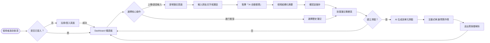
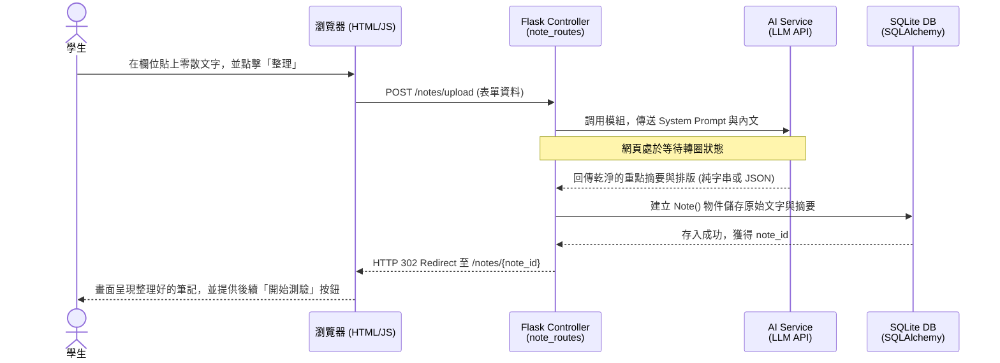

# 流程圖設計 (FLOWCHART) - AI 學習助理系統

本文件根據 PRD 與系統架構，盤點並視覺化「使用者如何操作系統」與「資料如何於系統運行」。有助於實作階段前確認功能頁面的串聯邏輯。

## 1. 使用者流程圖 (User Flow)

此流程圖描述學生進入網站後，使用系統最主要「記筆記」到「隨堂測驗」及「檢視學習狀況」的心智模型與操作動線。

## 2. 系統序列圖 (System Sequence Diagram)

以下模擬系統最複雜的單一操作：**「貼上筆記文字並由 AI 歸納整理後存入資料庫」** 的完整系統溝通順序。

## 3. 功能清單與 API 對照表

我們將畫面與操作對應至即將開工的 Flask 路由 (Routing) 規劃中。

| 功能名稱 | 描述與用途 | HTTP  方法 | 路由路徑 (URL Path) | 對應的模組/頁面 |
|---|---|---|---|---|
| **首頁 Dashboard** | 登入後首頁，顯示弱點建議與成績圖表 | `GET` | `/dashboard` 或 `/` | `dash_routes.py` / `dashboard/index.html` |
| **帳號登入** | 呈現登入畫面 | `GET` | `/login` | `auth_routes.py` / `auth/login.html` |
| **執行登入驗證** | 校對使用者帳密 | `POST` | `/login` | `auth_routes.py` |
| **帳號註冊** | 呈現註冊畫面 | `GET` | `/register` | `auth_routes.py` / `auth/register.html` |
| **執行註冊作業** | 存入新使用者資料 | `POST` | `/register` | `auth_routes.py` |
| **筆記總覽列表** | 列出學生過往整理過的所有筆記 | `GET` | `/notes` | `note_routes.py` / `notes/list.html` |
| **上傳/新增筆記** | 接收表單並交由 AI 處理摘要、存入DB | `POST` | `/notes/upload` | `note_routes.py` |
| **單一筆記檢視** | 檢視該筆記整理好的內容與操作測驗 | `GET` | `/notes/<note_id>` | `note_routes.py` / `notes/view.html` |
| **開始建立測驗** | 根據該筆記調用 AI 產生題目 | `POST` | `/exams/generate/<note_id>` | `exam_routes.py` |
| **測驗作答頁面** | 渲染答題卡或問答區給學生填寫 | `GET` | `/exams/<exam_id>` | `exam_routes.py` / `exams/take_exam.html` |
| **送出並批改** | 送交答題，將錯題送給 AI 提供解析 | `POST` | `/exams/submit/<exam_id>` | `exam_routes.py` |
| **檢視成績解析** | 顯示作答結果，包含弱點分析回饋 | `GET` | `/exams/result/<exam_id>` | `exam_routes.py` / `exams/result.html` |
